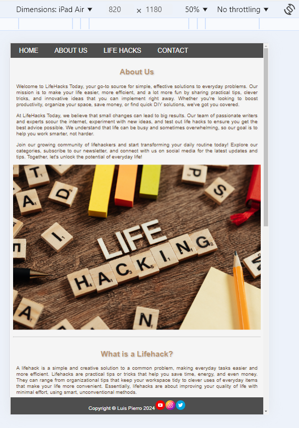
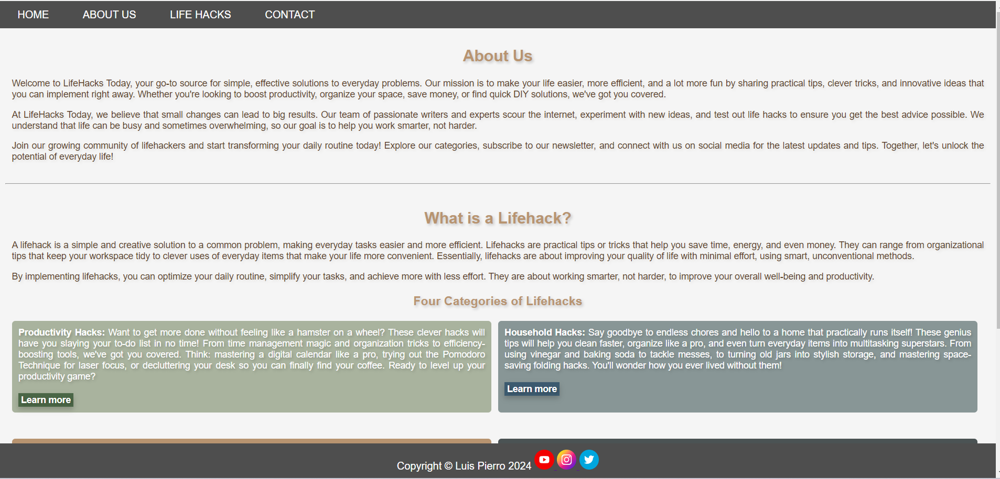
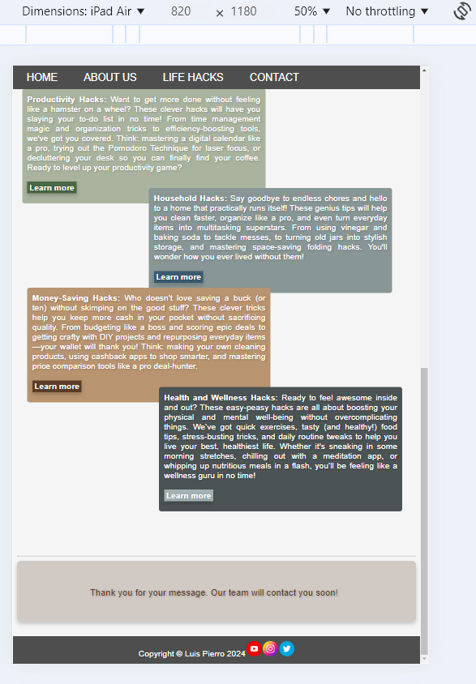

# Lifehacks Today

LifeHacks Today is your ultimate destination for smart, practical solutions to everyday challenges. We are committed to simplifying your life through productivity-boosting hacks, innovative household tricks, money-saving tips, and health and wellness insights. Whether you're seeking ways to streamline your daily tasks, declutter your home, or stretch your dollar further, our expertly curated lifehacks are designed to help you achieve more with less effort. We believe that small, thoughtful changes can make a big impact, empowering you to work smarter, save time, and elevate your overall well-being.

Our dedicated team of writers and experts explores the latest trends, tests new ideas, and delivers actionable advice that you can apply immediately. At LifeHacks Today, we know how busy life can be, and our goal is to provide you with solutions that are not only effective but also easy to implement. Join our vibrant community of lifehackers and explore our categories, from productivity to wellness, and start making the most of every moment. Together, we’ll turn everyday problems into opportunities for smarter, more efficient living!

Our Website on Tablets

Our Website on Mobiles

Our Website on Desktops

## Features

- __Navigation Bar__

- Full responsive, it include links to the three important anchors on the home page and also to return to it.
- Fixed, it follows you where you scroll down the page

__Cards Description__

-The website explanes the 4 categories of lifehacks. In a fun and collorfull card display, it changes the arrengement according to wich screen are you on

