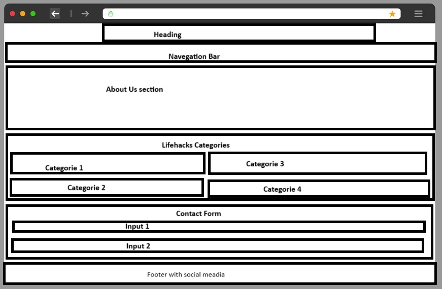
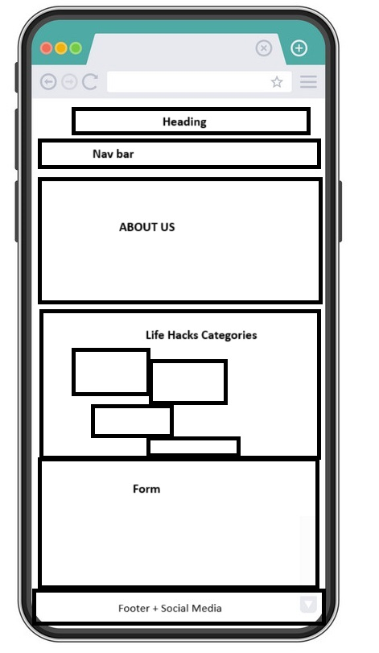
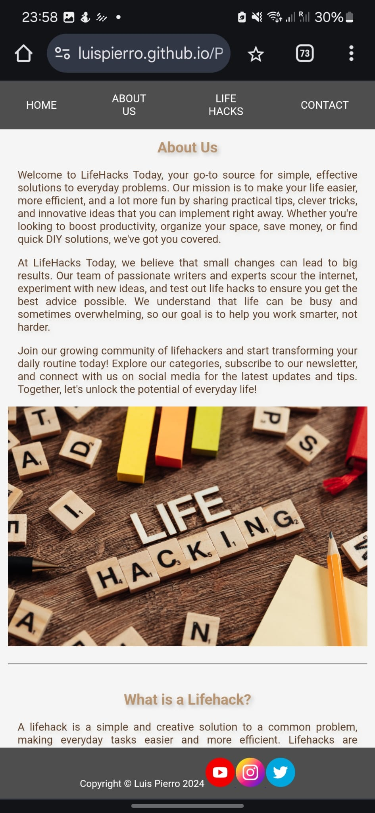
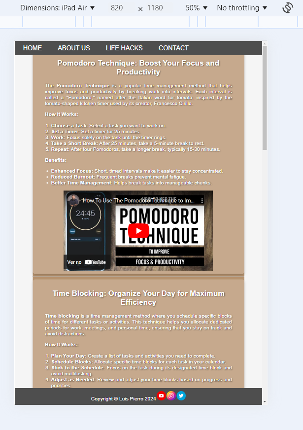
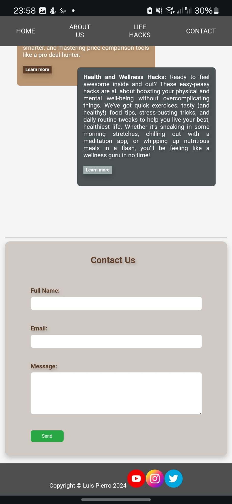

# Lifehacks Today

LifeHacks Today is your ultimate destination for smart, practical solutions to everyday challenges. We are committed to simplifying your life through productivity-boosting hacks, innovative household tricks, money-saving tips, and health and wellness insights. Whether you're seeking ways to streamline your daily tasks, declutter your home, or stretch your dollar further, our expertly curated lifehacks are designed to help you achieve more with less effort. We believe that small, thoughtful changes can make a big impact, empowering you to work smarter, save time, and elevate your overall well-being.

Our dedicated team of writers and experts explores the latest trends, tests new ideas, and delivers actionable advice that you can apply immediately. At LifeHacks Today, we know how busy life can be, and our goal is to provide you with solutions that are not only effective but also easy to implement. Join our vibrant community of lifehackers and explore our categories, from productivity to wellness, and start making the most of every moment. Together, we’ll turn everyday problems into opportunities for smarter, more efficient living!

## Design

### Wireframes

#### Desktop

#### Smartphones
!

### Screens

Our Website on Tablets

Our Website on Mobiles

Our Website on Desktops

## Features

- __Navigation Bar__

- Full responsive, it include links to the three important anchors on the home page and also to return to it.
- Fixed, it follows you where you scroll down the page

__Cards Description__

-The website explanes the 4 categories of lifehacks. In a fun and collorfull card display, it changes the arrengement according to wich screen are you on

__Life hacks blog__

While exploring the description of the categories, yu can click on each to see what kind of lifehacks have we posted on the blog. It takes you to each page. It's desined to look like a web vintage blog page. you can scroll up and down, discover more about the hacks by reading it or if it's more practicle, you can watch a youtube video explaining it.

__Contact Form__

The user can contact our blog's team to any kind of problem or suggetion they may have. The form is small, easy and direct. It has a simple validation of required filling and email format.

### Features Left to Implement

- User Login;
- Search for especific hacks,.

## Testing

The website was developed and thought for three major screen sizes: Phones -max 599px; Tablet -min 600px; Laptops and Desktops- min 992px.

It was tested using the inspect feature of the chrome browser and my actual phone and tablet.

### Validator Testing 

- HTML
  - No issues passing thru the W3C validator [W3C validator](https://validator.w3.org/nu/?doc=https%3A%2F%2Fluispierro.github.io%2FProject1-codeinstitute%2F)

- CSS
  - It has also complained about some usage of the box-shadow that made no sense for me. I have searched how to use the proportie, and it seems to be correct... [(Jigsaw) validator](https://jigsaw.w3.org/css-validator/validator?uri=https%3A%2F%2Fluispierro.github.io%2FProject1-codeinstitute%2Findex.html&profile=css3svg&usermedium=all&warning=1&vextwarning=&lang=pt-BR)

### Unfixed Bugs

I couldn't make the image go behide the text when changif to bigger screens. 

The footer text and image are not alligned vertically.

## Deployment 

- The site was deployed to GitHub pages. The steps to deploy are as follows: 
  - In the GitHub repository, navigate to the Settings tab 
  - From the source section drop-down menu, select the Master Branch
  - Once the master branch has been selected, the page will be automatically refreshed with a detailed ribbon display to indicate the successful deployment. 

The live link can be found here - https://luispierro.github.io/Project1-codeinstitute/index.html

## Credits 

### Content 

- The text for the Life hacks was taken Using AI, Gemini and Chat GPT. They have suggested the content of the hacks.
- The icons in the footer were taken from [Flat Icon](https://www.flaticon.com/br/icones-gratis/redes-sociais)
- The favicons in the title of the webpage were taken from [FavIcon.io](https://favicon.io/)

### Media

- The image used on the home  page are from This Open Source site [picjumbo](https://picjumbo.com/search/life+hacks)
- The videoss used for the lifehacks blog page were taken from this the youtube. The channels are:
  - [Engineering with Utsav](https://www.youtube.com/@EngineeringwithUtsav)
  - [Aurelius Tjin](https://www.youtube.com/@AureliusTjin)
  - [EISENHOWER](https://www.youtube.com/@EngineeringwithUtsav)
  - [PlanwithLaken](https://www.youtube.com/@PlanwithLaken)
  - [Koi](https://www.youtube.com/@KoiAcademy)
  - [Smartin24562](https://www.youtube.com/@Smartin24562)
  - [wikiHow](https://www.youtube.com/@wikiHow)  
  - [Token](https://www.youtube.com/@Token6789)
  - [Breathe and Flow](https://www.youtube.com/@BreatheAndFlow)

